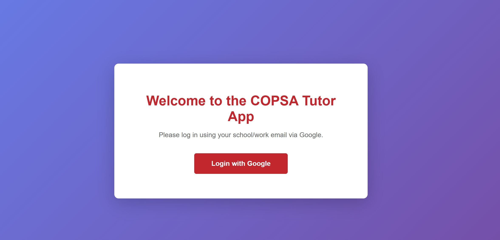
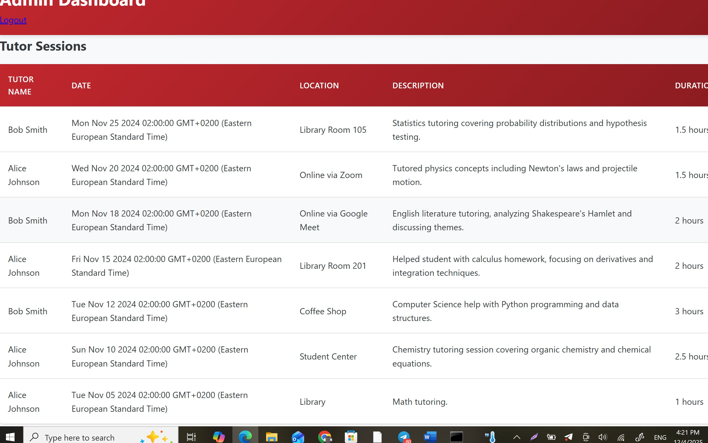
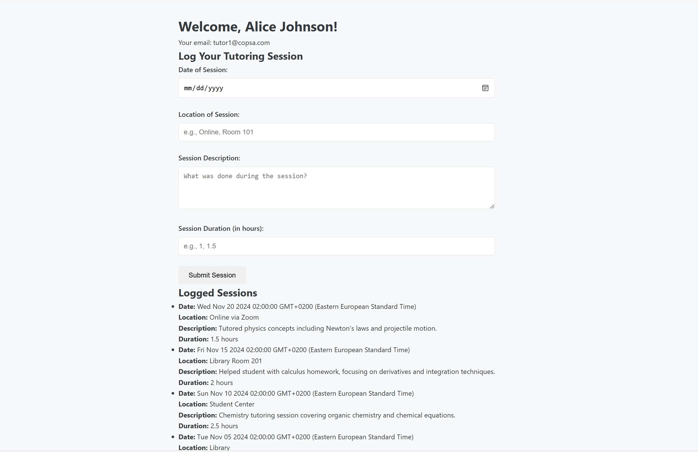
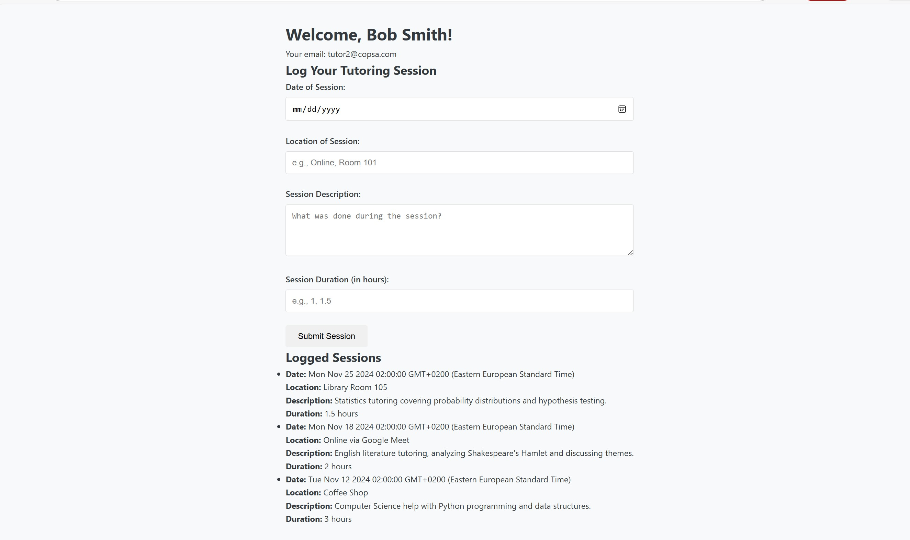
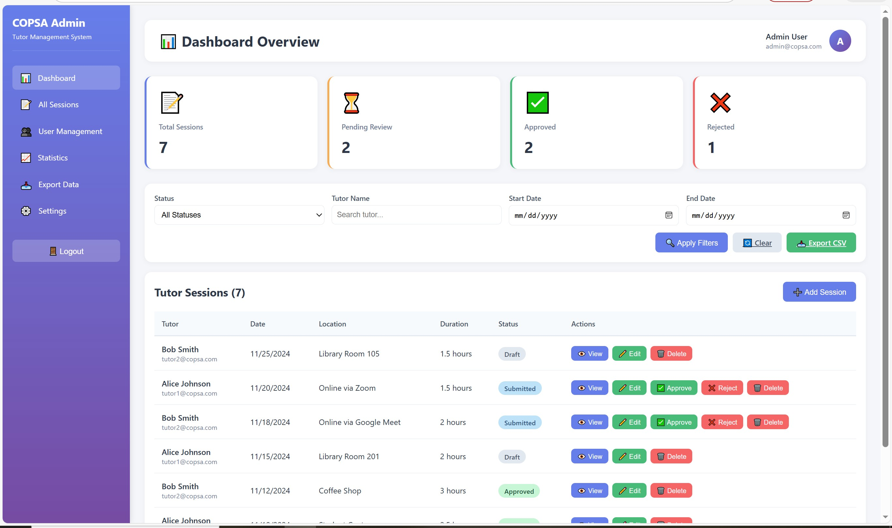

<<<<<<< HEAD
"# ????? ????" 
=======
This project is part of the AIMlearning project, which is co-funded by the European Union. The project will run from 1.2.2024 to 30.4.2027.

# COPSA Tutor Application

A web application for COPSA tutors to log their tutoring hours and for administrators to review and manage submissions. Built with Express.js, MongoDB, and EJS templating.

## Overview

This application allows tutors to:

- Log in via Google OAuth
- Submit tutoring session entries with details (date, location, description, hours)
- Track the status of their submissions (draft, submitted, approved, rejected)
- Switch between English and Finnish languages

Administrators can:

- View all tutor submissions
- Approve or reject tutoring entries
- Export data for reporting
- Send email notifications to tutors

## Features

- **Google OAuth Authentication**: Secure login using Google accounts
- **Role-Based Access Control**: Separate interfaces for tutors and administrators
- **Internationalization (i18n)**: Full support for English and Finnish languages
- **Session Management**: Secure session handling with configurable cookies
- **Email Notifications**: Automated email alerts for submission status changes
- **Status Tracking**: Track submissions through draft, submitted, approved, and rejected states
- **Admin Dashboard**: Comprehensive overview of all tutoring sessions
- **Audit Logging**: Complete history of admin review actions
- **Responsive Design**: Mobile-friendly interface

## Screenshots

### Landing Page & Authentication


_The landing page with Google OAuth authentication_

### Tutor Dashboard


_Tutor dashboard showing session management and submission tracking_

### Session Submission Form


_Detailed form for logging tutoring sessions with validation_

### Admin Dashboard


_Administrator dashboard with session review and filtering options_

### Session Review & Approval


_Admin interface for reviewing and approving/rejecting submissions_

## Technology Stack

- **Backend**: Node.js with Express.js
- **Database**: MongoDB with Mongoose ODM
- **Authentication**: Passport.js with Google OAuth 2.0
- **Templating**: EJS (Embedded JavaScript)
- **Email**: Nodemailer
- **Internationalization**: i18n
- **Testing**: Jest with Supertest and MongoDB Memory Server
- **Session Management**: express-session

## Prerequisites

Before running this application, ensure you have:

- **Node.js**: v14 or higher
- **MongoDB**: v4.4 or higher (local or cloud instance)
- **Google OAuth Credentials**: Client ID and Client Secret from Google Cloud Console
- **Email Account**: SMTP credentials for sending emails (Gmail recommended)

## Installation

1. **Clone the repository**

   ```bash
   git clone (https://github.com/AIMlearningProject/tutor-application/main)
   cd Tutor-Application--main
   ```

2. **Install dependencies**

   ```bash
   npm install
   ```

3. **Configure environment variables**

   Copy the `.env` file and update with your credentials:

   ```bash
   cp .env .env.local
   ```

   Edit `.env` with your actual values:

   ```env
   # Server Configuration
   PORT=3000
   NODE_ENV=development

   # Session Secret (generate a secure random string)
   SESSION_SECRET=your_secure_random_session_secret_here

   # Google OAuth 2.0 Credentials
   GOOGLE_CLIENT_ID=your_google_client_id
   GOOGLE_CLIENT_SECRET=your_google_client_secret
   GOOGLE_CALLBACK_URL=http://localhost:3000/auth/google/callback

   # MongoDB Connection
   MONGO_URI=mongodb://localhost:27017/copsa_tutor_app

   # Admin Configuration
   ADMIN_EMAIL=admin@example.com

   # Email Configuration (for Nodemailer)
   EMAIL_USER=your_email@gmail.com
   EMAIL_PASS=your_app_specific_password
   ```

4. **Set up Google OAuth**
   - Go to [Google Cloud Console](https://console.cloud.google.com/)
   - Create a new project or select existing one
   - Enable Google+ API
   - Create OAuth 2.0 credentials
   - Add authorized redirect URI: `http://localhost:3000/auth/google/callback`
   - Copy Client ID and Client Secret to `.env` file

5. **Set up MongoDB**

   Option A - Local MongoDB:

   ```bash
   # Start MongoDB service
   mongod --dbpath=/path/to/data/directory
   ```

   Option B - MongoDB Atlas (Cloud):
   - Create account at [MongoDB Atlas](https://www.mongodb.com/cloud/atlas)
   - Create a cluster
   - Get connection string and add to `MONGO_URI` in `.env`

## Running the Application

### Development Mode

```bash
npm start
```

The application will be available at `http://localhost:3000`

### Testing

Run all tests:

```bash
npm test
```

Run tests with watch mode:

```bash
npm run test:watch
```

Run unit tests only:

```bash
npm run test:unit
```

Run integration tests only:

```bash
npm run test:integration
```

View test coverage:

```bash
npm test
# Coverage report will be in ./coverage directory
```

## Project Structure

```
Tutor-Application--main/
├── src/
│   ├── app.js                    # Main application entry point
│   ├── emailService.js           # Email notification service
│   ├── locales/                  # Internationalization files
│   │   ├── en.json              # English translations
│   │   └── fi.json              # Finnish translations
│   ├── middleware/               # Custom middleware
│   │   ├── auth.js              # Authentication middleware
│   │   └── validation.js        # Input validation middleware
│   ├── models/                   # Mongoose data models
│   │   ├── AdminReviewLog.js    # Admin review audit log
│   │   ├── TutorSession.js      # Tutoring session entries
│   │   └── User.js              # User accounts
│   ├── routes/                   # Express route handlers
│   │   ├── adminRoutes.js       # Admin-specific routes
│   │   ├── authRoutes.js        # Authentication routes
│   │   └── tutorRoutes.js       # Tutor-specific routes
│   └── views/                    # EJS templates
│       ├── adminDashboard.ejs   # Admin dashboard view
│       ├── dashboard.ejs        # Tutor dashboard view
│       ├── error.ejs            # Error page
│       ├── index.ejs            # Landing page
│       └── tutorForm.ejs        # Session submission form
├── public/                       # Static assets
│   ├── index.html               # Static HTML files
│   └── styles.css               # CSS stylesheets
├── tests/                        # Test files
│   ├── unit/                    # Unit tests
│   └── integration/             # Integration tests
├── coverage/                     # Test coverage reports
├── .env                         # Environment variables (not in git)
├── package.json                 # Node.js dependencies and scripts
├── softwareplan.md              # Original software requirements
└── README.md                    # This file
```

## Data Models

### User

```javascript
{
  googleId: String,           // Google OAuth ID
  name: String,               // User's full name
  email: String,              // User's email address
  role: String,               // 'tutor' or 'admin'
  language_preference: String, // 'en' or 'fi'
  created_at: Date,
  updated_at: Date
}
```

### TutorSession

```javascript
{
  user_id: ObjectId,          // Reference to User
  tutorName: String,          // Tutor's name
  tutorEmail: String,         // Tutor's email
  date: Date,                 // Session date
  location: String,           // Session location
  description: String,        // Session description
  hours: Number,              // Hours worked (min: 0.5)
  status: String,             // 'draft', 'submitted', 'approved', 'rejected'
  submitted_at: Date,         // When submitted
  reviewed_at: Date,          // When reviewed
  review_note: String,        // Admin's review note
  created_at: Date,
  updated_at: Date
}
```

### AdminReviewLog

```javascript
{
  admin_id: ObjectId,         // Reference to admin User
  entry_id: ObjectId,         // Reference to TutorSession
  action: String,             // 'approved' or 'rejected'
  note: String,               // Review notes
  timestamp: Date
}
```

## API Routes

### Authentication Routes (`/auth`)

- `GET /auth/google` - Initiate Google OAuth login
- `GET /auth/google/callback` - Google OAuth callback
- `GET /auth/logout` - Logout user

### Tutor Routes (`/tutor`)

- `GET /tutor/sessions` - View tutor's own sessions
- `POST /tutor/sessions` - Create new session
- `PUT /tutor/sessions/:id` - Update session (draft only)
- `DELETE /tutor/sessions/:id` - Delete session (draft only)
- `POST /tutor/sessions/:id/submit` - Submit session for review

### Admin Routes (`/admin`)

- `GET /admin/sessions` - View all sessions
- `GET /admin/sessions/:id` - View session details
- `POST /admin/sessions/:id/approve` - Approve session
- `POST /admin/sessions/:id/reject` - Reject session
- `GET /admin/export` - Export sessions to CSV/Excel

### General Routes

- `GET /` - Landing page
- `GET /dashboard` - User dashboard (role-based)
- `GET /language/:lang` - Switch language (en/fi)

## Localization

The application supports English and Finnish languages. Language files are located in `src/locales/`:

- `en.json` - English translations
- `fi.json` - Finnish translations

Users can switch languages using the language selector in the UI. Language preference is:

1. Stored in user profile (if logged in)
2. Stored in cookie (if not logged in)
3. Auto-detected from browser settings

## User Roles

### Tutor

- Log tutoring sessions
- Submit sessions for approval
- View own session history
- Track submission status
- Edit/delete draft sessions

### Administrator

- View all tutor sessions
- Approve or reject submissions
- Add review notes
- Export data for reporting
- Manage user roles
- Send email notifications

## Email Notifications

The application sends automated emails for:

- New session submissions (to admin)
- Session approval (to tutor)
- Session rejection (to tutor)

Configure email settings in `.env`:

```env
EMAIL_USER=your_email@gmail.com
EMAIL_PASS=your_app_specific_password
```

**Note**: For Gmail, use [App-Specific Passwords](https://support.google.com/accounts/answer/185833)

## Security Features

- **OAuth 2.0**: Secure authentication via Google
- **Session Management**: Secure cookies with httpOnly and secure flags
- **Role-Based Access**: Route protection based on user roles
- **Input Validation**: Server-side validation for all inputs
- **CSRF Protection**: Session-based CSRF tokens
- **Secure Headers**: Production-ready security headers
- **Audit Logging**: Complete history of admin actions

## Deployment

### Environment Variables for Production

Update `.env` for production:

```env
NODE_ENV=production
PORT=3000
SESSION_SECRET=<generate-strong-random-string>
GOOGLE_CALLBACK_URL=https://yourdomain.com/auth/google/callback
MONGO_URI=<production-mongodb-uri>
```

### Deployment Platforms

**Option 1 - Heroku**

```bash
heroku create copsa-tutor-app
heroku config:set SESSION_SECRET=<secret>
heroku config:set GOOGLE_CLIENT_ID=<id>
heroku config:set GOOGLE_CLIENT_SECRET=<secret>
heroku config:set MONGO_URI=<uri>
git push heroku main
```

**Option 2 - Render**

- Connect GitHub repository
- Set environment variables in Render dashboard
- Deploy automatically on git push

**Option 3 - Docker**

```dockerfile
FROM node:14
WORKDIR /app
COPY package*.json ./
RUN npm install --production
COPY . .
EXPOSE 3000
CMD ["npm", "start"]
```

## Development Workflow

1. **Create a feature branch**

   ```bash
   git checkout -b feature/your-feature-name
   ```

2. **Make changes and test**

   ```bash
   npm test
   ```

3. **Commit changes**

   ```bash
   git add .
   git commit -m "Description of changes"
   ```

4. **Push and create PR**
   ```bash
   git push origin feature/your-feature-name
   ```

## Troubleshooting

### MongoDB Connection Issues

- Ensure MongoDB is running: `mongod`
- Check `MONGO_URI` in `.env`
- Verify network connectivity for cloud MongoDB

### Google OAuth Errors

- Verify Client ID and Secret in `.env`
- Check authorized redirect URIs in Google Console
- Ensure callback URL matches `.env` configuration

### Session Issues

- Verify `SESSION_SECRET` is set
- Clear browser cookies
- Check session configuration in `app.js`

### Email Not Sending

- Verify email credentials in `.env`
- Use app-specific password for Gmail
- Check spam folder for test emails

## Contributing

1. Fork the repository
2. Create a feature branch
3. Make your changes
4. Add tests for new features
5. Ensure all tests pass
6. Submit a pull request

## License

ISC

## Support

For issues, questions, or contributions, please:

- Open an issue in the repository
- Contact the development team
- Refer to `softwareplan.md` for design decisions

## Acknowledgments

- **COPSA** - Community Peer Support Association
- **Centria University of Applied Sciences**
- All tutors and administrators using this application
>>>>>>> 146b61a (Initial project push)
